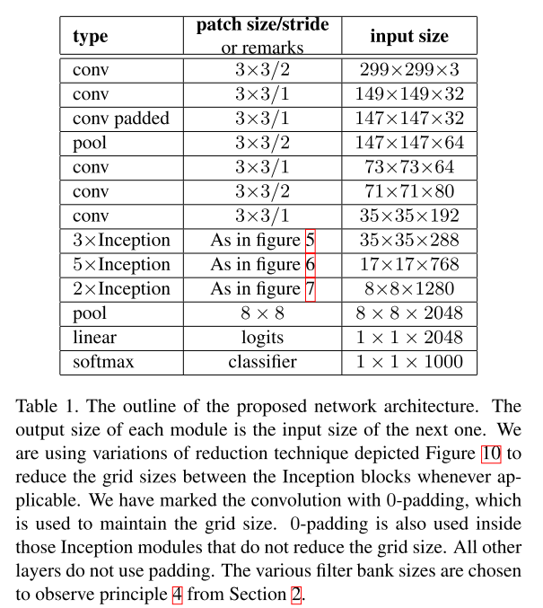
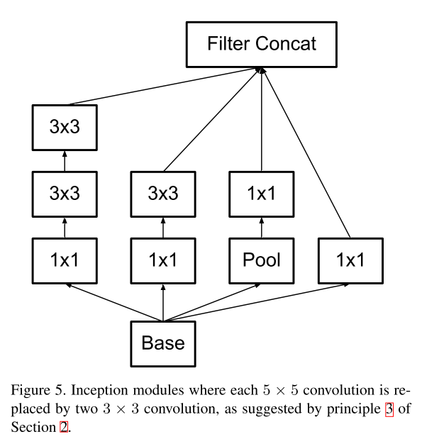
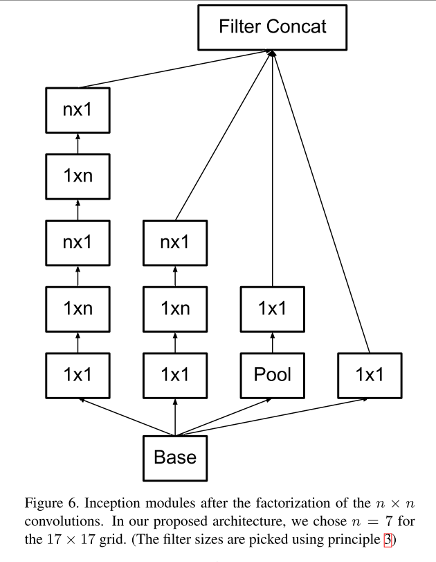
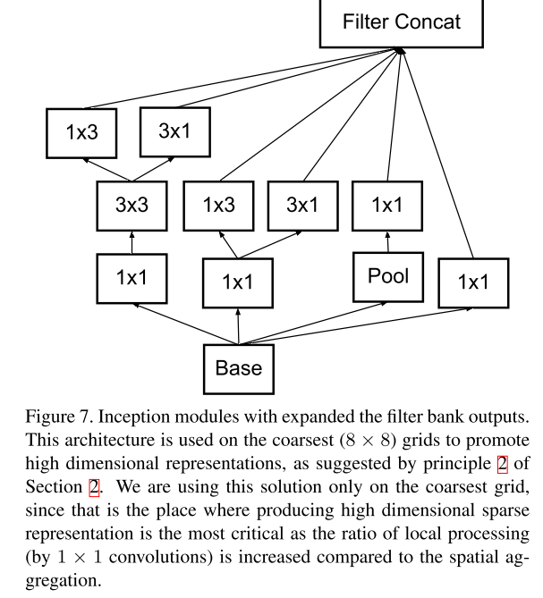

### [Rethinking the Inception Architecture for Computer Vision](https://arxiv.org/abs/1512.00567)

Netscope: http://ethereon.github.io/netscope/#gist/a2394c1c4a9738469078f096a8979346

[PaperNotes(in Chinese)](https://blog.ddlee.cn/2017/12/16/%E8%AE%BA%E6%96%87%E7%AC%94%E8%AE%B0-Rethinking-the-Inception-Architecture-for-Computer-Vision/)

### Model Details

InceptionA Module

InceptionB Module

InceptionC Module

